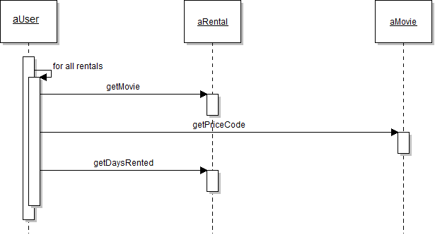
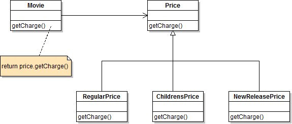

# Refactoring

The aim of this tutorial is to let you apply some of the refactorings you just learned in the  classroom. Do not hesitate to ask your lecturer.

### Introduction
For this purpose we have prepared a simplified version the Movie Rental System application. To keep things simple, it contains only the model classes. However the class User contains a new method ``statement`` which calculates the current fees for the user's rentals and returns the statement as a string. The developer of the new method has done poor work; the new method suffers several smells. So you need to clean up the code with several refactorings. At least the developer has implemented a test, so that we have a test bed for doing a save refactoring.  

### Preparations
2. Run all tests of the UserTest class.
3. Get an overview about how the program works. The following diagrams may be helpful.

  The class diagram contains all classes but shows only the most important features.
  
  

  The sequence diagram shows the execution path of the statement() method.
  
  

4.	Calculate the Cyclomatic Complexity of the User.statement() method by yourself. Compare your calculation with the result of the plug-in which you installed. 
5.	Have a more in-depth look at the statement() method – what main problems do you see with this method?

 
### Refactor

So, let’s improve the code to make it much more readable and easier to maintain. 

**Remember, while doing a refactoring do not change the external behavior of the code**. 

Make small save steps and run the tests after each step.

Eclipse and IntelliJ both support refactorings very well. It’s recommendable to use these, since they are typically a much safer. But in this exercise, also try to execute refactorings  manually, just to get practice.

1.	The `statement()` method is pretty long. Use **Extract Method** to put the switch statement into a separate method  `public double amountFor(Rental aRental)`.

  Caution: the automated Eclipse refactoring might create an unnecessary parameter. 

  Do not apply automated refactorings without caution.

  We have created a new method – we should also test it! So write a test for it.

2.	Everything still working fine? So let’s continue and improve naming. Rename the following variables in the new method: `each` to `aRental` and `thisAmount` to `result`.

3.	Have a look at the new method. You remember the discussion about cohesion? Do you think the method is in the right class? Why (not)? In which class would the method fit better? 

  So, move the method `amountFor()` from the class `User` to the new class using the **Move Method Refactoring**. 

  We have moved the method – what happens with the test?

4.	Again improve the naming. Change the name of `amountFor` to `public double getCharge()`

5.	In method `statement()` the variable `thisAmount` is assigned only once and left unchanged thereafter. Following the idea of **Inline Variable**, this variable can be eliminated and queried through a call to `each.getCharge()`. This refactoring is sometimes also called **Replace Temp with Query**.

6.	Staying in the `statement()` method, the two lines 
`frequentRenterPoints++;` und  `if ((each.getMovie().getPriceCode...;`  can be extracted into a separate Method `getFrequentRenterPoints()` (of course together with the comments!).
We have created new methods – we should test it.

7.	The new method shall only return the new RentalPoints, and not do the adding the anymore. For this we need to remove the parameter. To do this, we have to change the implementation of the method slightly. We introduce new counter (e.g. int result) and return it. Once the parameter is no longer used, we can remove it. In order not to change the behavior, we must not forget to add the new points to the existing ones. For better understandability, we rename the variable `frequentRenterPoints` to `totalFrequentRenterPoints`. (Now it is especially important to run the tests!).

8.	This new method should also be moved to class `Rental`. Can you explain why?

9.	The statement method still does the a lot of calculation for the `totalAmount` and `totalFrequentRenterPoints` and not just only creates the statement string. To improve this, introduce the methods `getTotalCharge()` and `getTotalFrequentRenterPoints()`. Again apply the **Replace Temp with Query** refactoring for this. However you can’t do this with the automatic refactoring, because there is write access to the local variables.

  Additional difficulty: the for loop has to be moved to the two new methods. 

  So, here it is especially important to run the tests after each step.

10.	For now, you are done with the refactoring of the `User.statement()` method. Each method has exatly one responsibility, that looks good! Before you continue with the following tasks, analyse the other classes `Rental` and `MovieImpl`. Anything you can improve there? Go ahead! 

11.	You may have noticed that `getCharge()` still is not at the right place. Why not? Move the method to the right class. Take care, that no new dependency to the Rental class is introduced.
 Do this by introducing the parameter daysRented (number of days of the rental) for the getCharge method (**Introduce Parameter**). Change the code, such that **Rental.movie** can be set to private again.

12.	Do the same process with the `getFrequentRenterPoints()` method. Remove the no longer needed parameter `Rental`. Look once more at the Rental class. Are you happy with it?

13.	Remains the `MovieImpl` class. To replace the switch-statement with Polymorphism it would be possible to derive three subclasses from MovieImpl: `RegularMovie`, `ChildrensMovie` and `NewReleaseMovie`. The each subclass could implement its own version of getCharge. This would require the refactorings **Self Encapsulate Field** and **Replace Conditional with Polymorphism**.  But unfortunately, then a video could not change its classification (new, regular, ...).

  A more flexible but slightly more complex refactoring would be to apply the **State Pattern** instead of direct inheritance. The class diagram illustrates the solution.
  
  

  Apply the following refactorings for this: **Replace Type Code with State/Strategy**, **Move Method**. The resulting classes are shown in the class diagram below. In a first step, use **Self Encapsulate Field** to improve the use of the priceCode variable.

*Compare the solution you have right now with the original one. Did it improve?*